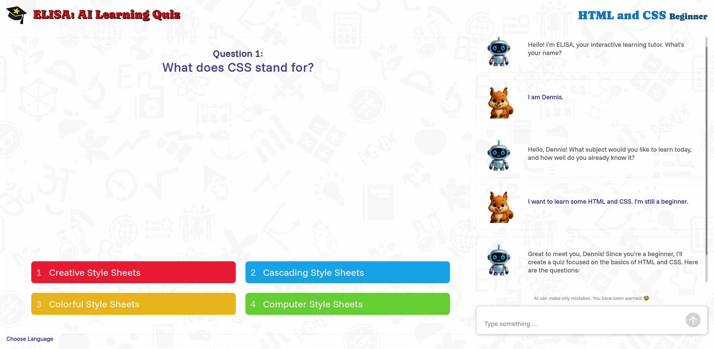

Elisa: Learning Quizzes
=======================

1. [Description](#deployment)
1. [More Information](#more-information)
1. [Deployment Overview](#deployment-overview)
1. [Manual Build and Deployment](#manual-build-and-deployment)
1. [Pre-Built Distribution Package](#pre-built-distribution-package)
1. [Configuration Options](#configuration-options)
1. [Deployment with Docker](#deployment-with-docker)
1. [Copyright](#copyright)

Description
===========



”Hi, I am Elisa, your personal learning assistant“–A learning assistant that is able
to explain almost any topic and create quizzes to test your learning progress. It is
small, it is fun, it is engaging and easy to use. It is a chatbot backed by Large
Language Models or AI as most people would say. 🪄 And it is Free Software - as in
freedom and not in beer. 🍺

Right now it is an prototype and experiment that I did with students to build AI
learning tools. Actually it is not very fancy. But hopefully it is still useful and
given enough community interest many features could be added. Let's get in touch to
share ideas and get the stone rolling.

More Information
================

Everyone is gladly invited to build upon this, share it and enhance it. The following
documents provide some technical information.

 * [Developer Notes](./HACKING.md)
 * [Code of Conduct](./CODE_OF_CONDUCT.md)

Deployment Overview
===================

**IMPORTANT:** Currently there is no user authentication whatsoever. If you plan to deploy
on a public server, you need to use the possibilities of your web server to restrict access,
if necessary.

This project consists of two parts:

* **Backend:** A simple python application built with [FastAPI](https://fastapi.tiangolo.com/).
* **Frontend:** A static Single Page App built with [Svelte](https://svelte.dev/)

**Prerequisites:**

1. API access to a Language Model (self-hosted or commercial subscription)
   See [LangChain documentation](https://python.langchain.com/api_reference/langchain/chat_models/langchain.chat_models.base.init_chat_model.html)
1. A (sub)domain and webserver host under your control.

Deployment usually means to start the backend server (by default using [Uvicorn](https://www.uvicorn.org/))
on a localhost network address (non-public) and configuring a web server to host the frontend
and act as a reverse-proxy for the backend. The only consideration is, that the web server must
also proxy web socket connections since frontend and backend communicate exclusively over web sockets
(to enable two-way message exchange in real-time). [Caddy](https://caddyserver.com/) is field proven
and super easy to setup (including automatic SSL certificate management!).

1. Get API key for your Large Language Model
1. Download the source code (e.g. with Git)
1. Install all dependencies (with `npm` and `poetry`)
1. Run the backend server (e.g. with the provided SystemD service file)
1. Setup frontend web server
1. Done!

The next sections explain three different deployment approaches:

1. Manually building the source
1. Pre-built distribution package
1. Docker and Docker Compose

Manual Build and Deployment
===========================

The following shell commands show a manual setup on a typical Linux box (here Debian or Ubuntu),
building and running the latest greatest version from source.

```sh
# Install python runtime and poetry package manager (needed to run the backend)
sudo apt install python3 python3-poetry

# Install NodeJS and NPM package manager (only needed to build the frontend)
sudo apt install nodejs npm

# Download source code
# NOTE: When not installing to /opt/elisa-quiz please adopt paths in elisa-quiz.service
cd /opt
sudo git clone https://github.com/DennisSchulmeister/elisa-quiz.git

# Install all Node.js dependencies
sudo npm install

cd frontend
sudo npm install

# Build frontend (output will be in static/_bundle)
npm run build

# Create python environment and install python dependencies
cd ../backend
sudo poetry env use $(which python)
sudo poetry install

# Create .env file with OpenAI API key (or others supported by LangChain)
sudo cp .env.template .env
sudo nano .env

# Create and start SystemD service
cd ..
sudo cp elisa-quiz-poetry.service.template /etc/systemd/system/elisa-quiz.service
sudo systemctl daemon-reload
sudo systemctl enable elisa-quiz
sudo systemctl start elisa-quiz

# Check if the backend server has successfully started
sudo systemctl status elisa-quiz
sudo journalctl -fu elisa-quiz

# Install, enable and start webserver
sudo apt install caddy
sudo systemctl enable caddy
sudo systemctl start caddy

# Edit web server configuration (see example below)
sudo nano /etc/caddy/Caddyfile

# Reload web server configuration and test for errors
sudo systemctl reload caddy
sudo systemctl status caddy
sudo journalctl -fu caddy
```

Example Caddy configuration, assuming the backend server listens on `localhost:8000`.
This is bascially the same file as [frontend/docker/Caddyfile](./frontend/docker/Caddyfile)
in the source-tree minus the dynamic configuration with environment variables.

```
your-domain.com {
    encode gzip

    file_server
    root * /opt/elisa-quiz/frontend/static
    respond /api.url "https://your-domain.com"

    reverse_proxy /ws/* localhost:8000

    basic_auth {
        # Username "elisa", password "elisa"
        # See: https://caddyserver.com/docs/caddyfile/directives/basic_auth
        # Use "caddy hash-password" to create the password hash
		elisa $2a$14$39ezPLC8X9ODipWKGrVY/OEcNVULLLudQuUtEWxFNQUnaGyXZFNhK
    }
}
```

Yes, that's all. And Caddy even manages a [Let's Encrypt](https://letsencrypt.org/)
SSL certificate for us. As much as I loved [Apache](httpd.apache.org) (running it
for almost twenty yours on countless machines) – beat this!

If you need to start the backend server on another network address, edit the SystemD service
file and pass `--host <ip-address>` and/or `--port <port-number>` arguments to `main.py`.

If the public backend URL will have different host than the frontend URL, you need to handle
the CORS preflight. Here is a short example:

```
# https://gist.github.com/vanodevium/563c7a3b1db7d5361f64388e62f9d08f
(cors) {
	@cors_preflight method OPTIONS

	header {
		Access-Control-Allow-Origin "{header.origin}"
		Vary Origin
		Access-Control-Expose-Headers "Authorization"
		Access-Control-Allow-Credentials "true"
	}

	handle @cors_preflight {
		header {
			Access-Control-Allow-Headers "*"
			Access-Control-Allow-Methods "GET, POST, PUT, PATCH, DELETE"
			Access-Control-Max-Age "3600"
		}
		respond "" 204
	}
}

# Frontend
your-domain.com {
    encode gzip
    file_server
    root * /opt/elisa-quiz/frontend/static
    respond /api.url "https://api.your-domain.com"
}

# Backend
api.your-domain.com {
    import cors {header.origin}
    reverse_proxy /ws/* localhost:8000
}
```

Pre-Built Distribution Package
==============================

This repository contains the pre-built distribution package [dist/elisa-quiz.zip](./dist/elisa-quiz.zip),
which will be updated from time to time (using the command `npm run dist`). This saves you
from installing [Node.js](https://nodejs.org/) and [Poetry](https://python-poetry.org/),
so that you can directly setup the backend service and web server:

```sh
# Install python runtime and pip package manager (needed to run the backend)
sudo apt install python3 python3-pip

# Download source code
# NOTE: When not installing to /opt/elisa-quiz please adopt paths in elisa-quiz.service
cd /opt
sudo mkdir elisa-quiz
cd elisa-quiz
sudo wget https://raw.githubusercontent.com/DennisSchulmeister/elisa-quiz/refs/heads/main/dist/elisa-quiz.zip
sudo unzip elisa-quiz.zip

# Create python environment and install python dependencies
cd backend
sudo python -m venv .venv
. .venv/bin/activate
sudo pip install -r requirements.txt

# Create .env file with OpenAI API key (or others supported by LangChain)
sudo cp .env.template .env
sudo nano .env

# Create and start SystemD service
cd ..
sudo cp elisa-quiz-pip.service.template /etc/systemd/system/elisa-quiz.service
sudo systemctl daemon-reload
sudo systemctl enable elisa-quiz
sudo systemctl start elisa-quiz

# Check if the backend server has successfully started
sudo systemctl status elisa-quiz
sudo journalctl -fu elisa-quiz

# Install, enable and start webserver
sudo apt install caddy
sudo systemctl enable caddy
sudo systemctl start caddy

# Edit web server configuration (see example below)
sudo nano /etc/caddy/Caddyfile

# Reload web server configuration and test for errors
sudo systemctl reload caddy
sudo systemctl status caddy
sudo journalctl -fu caddy
```

The Caddy configuration remains the same as in the previous section.

Configuration Options
=====================

The backend start-up file `main.py` accepts the following command line arguments:

* `--host`, `-h`: Host IP address of the network interface to bind to
* `--port`, `-p`: Port number to listen on
* `--reload`: Restart server when the python code has changed (meant for development, only)

Additionally it reads the following environment variables, some of which being overridden by
the command line arguments:

* `UVICORN_HOST`: Host IP address (same as `--host` argument)
* `UVICORN_PORT`: Port number (same as `--port` argument)
* `UVICORN_RELOAD`: Live-reloading (same as `--reload` argument)
* `LLM_CHAT_MODEL`: Technical name of the used language model (according to LangChain documentation)
* `LLM_MODEL_PROVIDER`: Technical name of the language model provider (if it cannot be infered from the model name)
* `LLM_BASE_URL`: Non-standard base URL for the language model API (if not the official one)
* `OPENAI_API_KEY`: API key for the language model (the name of the variable actually depends on the chosen language model)

Deployment with Docker
======================

The docker files in the [frontend](./frontend) and [backend](./backend) directories
should be generic enough to be directly used. Except that the frontend container
has hard-coded BASIC authentication (in the `Caddyfile`) with username and password
`elisa` as in the manual deployment examples.

But the docker compose template using these containers must be adapter local environment.
Hence the `.template` suffix. Things you might want to adapt:

* If there is already a web-server running on the host, you don't need to run another
  one inside Docker. Just download the pre-built distribution package and directly
  serve the SPA as described above.

* When running the frontend in Docker, you need to set a few environment variables:

   - `DOMAIN`: Public domain under which to serve the application
   - `BACKEND_URL`: URL with which the frontend connects to the backend
   - `BACKEND_HOST`: (optional): Internal host name of the backend (default: backend)
   - `BACKEND_PORT`: (optional): Internal port number of the backend (default: 8000)

Just copy [docker-compose.yml.template](docker-compose.yml.template) to `docker-compose.yml`
and make your changes. Just like `.env` this file is excluded from git. Then start with
the usual `docker compose up -d` command.

Copyright
=========

**© 2025 DHBW Karlsruhe / Studiengang Wirtschaftsinformatik (Business Informatics)** <br>
**Dennis Schulmeister-Zimolong** <dennis@pingu-mail.de> <br/>
Licensed under the AGPL-3.0 license (Affero General Public License 3)